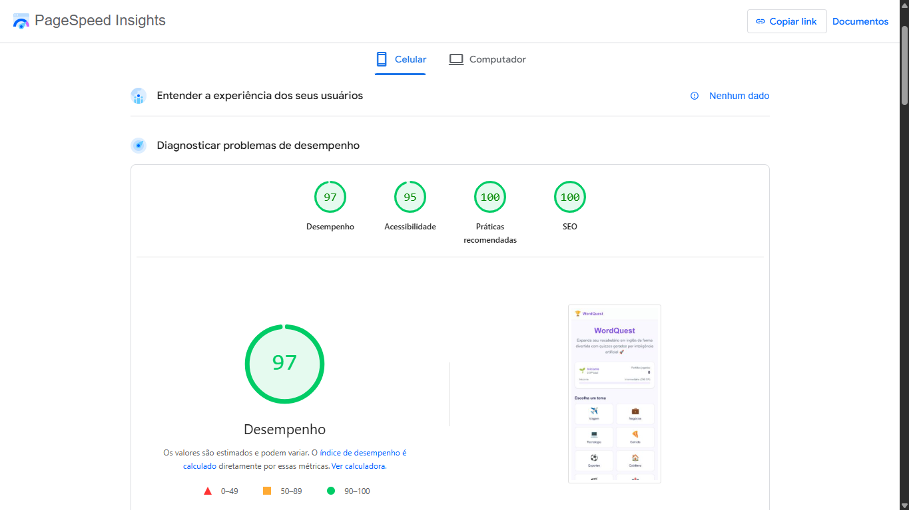
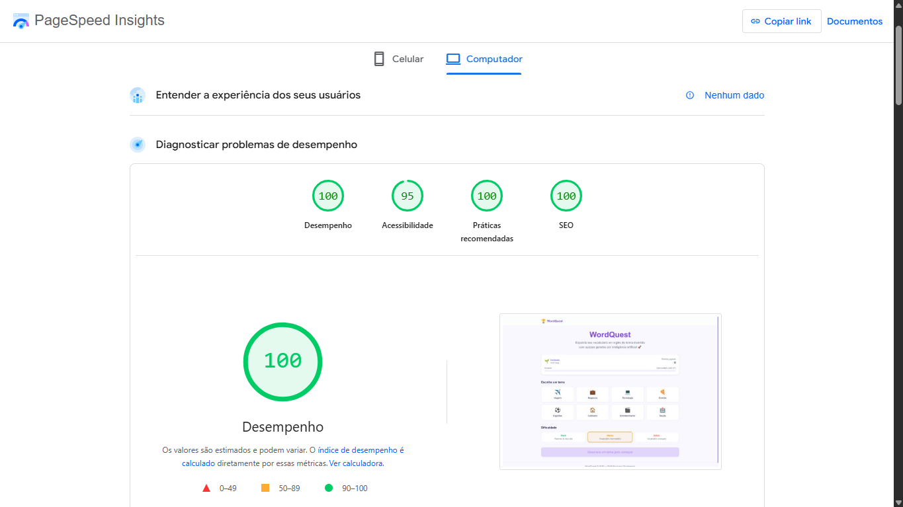

# 🎮 WordQuest

Aplicação web gamificada para estudo de vocabulário em inglês, com quizzes gerados dinamicamente por inteligência artificial. Construída como projeto da disciplina de **Front-end Engineering** da FIAP.

## 📋 Sumário

- [Sobre o Projeto](#sobre-o-projeto)
- [Funcionalidades](#funcionalidades)
- [Stack Utilizada](#stack-utilizada)
- [Pré-requisitos](#pré-requisitos)
- [Como Executar Localmente](#como-executar-localmente)
- [Variáveis de Ambiente](#variáveis-de-ambiente)
- [Estrutura do Projeto](#estrutura-do-projeto)
- [Deploy](#deploy)
- [Web Vitals — Lighthouse](#web-vitals--lighthouse)
- [Integrantes](#integrantes)

## 🎯 Sobre o Projeto

O **WordQuest** é uma plataforma interativa que ajuda estudantes brasileiros a expandirem seu vocabulário em inglês de forma divertida. A aplicação consome um BFF (Back-end for Front-end) próprio que utiliza o **Google Gemini** para gerar palavras, descrições e exemplos de uso dinamicamente.

O usuário escolhe um tema e nível de dificuldade, e a IA gera um quiz com 10 perguntas de múltipla escolha. A cada acerto, o jogador ganha XP e sobe de nível, com sistema de streak que incentiva sequências de acertos.

## ✨ Funcionalidades

- **8 temas** de vocabulário: Viagem, Negócios, Tecnologia, Comida, Esportes, Cotidiano, Entretenimento e Saúde
- **3 níveis de dificuldade:** Fácil, Médio e Difícil
- **Quiz interativo** com 4 alternativas de múltipla escolha
- **Sistema de XP e níveis** (Iniciante → Intermediário → Avançado → Expert)
- **Streak de acertos** com bônus de XP
- **Histórico de jogos** salvo no localStorage
- **Interface 100% em Português (BR)**
- **Design responsivo** para mobile e desktop
- **Animações suaves** com Framer Motion

## 🛠️ Stack Utilizada

| Tecnologia | Versão | Propósito |
|---|---|---|
| **Next.js** | 16.x | Framework React com App Router |
| **React** | 19.x | Biblioteca de UI |
| **TypeScript** | 5.x | Tipagem estática |
| **Tailwind CSS** | 4.x | Estilização utility-first |
| **Framer Motion** | 12.x | Animações e transições |
| **localStorage** | — | Persistência de dados do jogador |

## 📦 Pré-requisitos

- **Node.js** v20 ou superior
- **npm** v9 ou superior
- O **WordQuest BFF** rodando localmente ou deployado (veja o [repositório do BFF](https://github.com/SEU-USUARIO/wordquest-bff))

## 🚀 Como Executar Localmente

1. Clone o repositório:
```bash
git clone https://github.com/SEU-USUARIO/wordquest-app.git
cd wordquest-app
```

2. Instale as dependências:
```bash
npm install
```

3. Configure as variáveis de ambiente:
```bash
cp .env.example .env.local
```
Edite o arquivo `.env.local` com a URL do BFF.

4. Inicie o servidor de desenvolvimento:
```bash
npm run dev
```

A aplicação estará disponível em `http://localhost:3000`.

## 🔐 Variáveis de Ambiente

| Variável | Obrigatória | Descrição | Padrão |
|---|---|---|---|
| `NEXT_PUBLIC_BFF_URL` | ✅ | URL do BFF (backend) | `http://localhost:3001` |

## 📁 Estrutura do Projeto

```
src/
├── app/
│   ├── layout.tsx         # Layout principal (header, footer)
│   ├── page.tsx           # Página inicial (seleção de tema/dificuldade)
│   ├── globals.css        # Estilos globais e variáveis de tema
│   └── quiz/
│       └── page.tsx       # Página do quiz e resultados
├── components/
│   ├── PlayerStats.tsx    # Painel de XP, nível e progresso
│   ├── Selectors.tsx      # Seletores de tema e dificuldade
│   ├── QuizCard.tsx       # Card de pergunta com alternativas
│   ├── ResultSummary.tsx  # Resumo dos resultados do quiz
│   └── LoadingError.tsx   # Estados de loading e erro
└── lib/
    ├── api.ts             # Comunicação com o BFF
    ├── gamification.ts    # Lógica de XP, níveis e streak
    ├── storage.ts         # Persistência via localStorage
    └── utils.ts           # Utilitários (cn para classes CSS)
```

## ☁️ Deploy

### Deploy na Vercel (recomendado)

1. Crie uma conta em [vercel.com](https://vercel.com)
2. Importe o repositório do GitHub
3. Configure a variável de ambiente:
   - `NEXT_PUBLIC_BFF_URL` = URL do seu BFF deployado (ex: `https://wordquest-bff.onrender.com`)
4. Clique em **Deploy**
5. O deploy será automático a cada push na branch `main`

### Build manual

```bash
npm run build    # Gera build otimizado
npm start        # Inicia servidor de produção
```

## 📊 Web Vitals — Lighthouse

> **Nota:** Substitua a imagem abaixo pelo print real do Lighthouse após o deploy.




### Métricas e seus significados:

| Métrica | Significado |
|---|---|
| **Performance** | Mede a velocidade de carregamento da página, incluindo tempo para exibir o primeiro conteúdo visível e tornar a página interativa. Quanto mais alto, mais rápida a experiência do usuário. |
| **Accessibility** | Avalia se a página é acessível para todos os usuários, incluindo pessoas com deficiência. Verifica contraste de cores, atributos ARIA, navegação por teclado e textos alternativos em imagens. |
| **Best Practices** | Analisa se a página segue as melhores práticas de desenvolvimento web, como uso de HTTPS, ausência de erros no console, APIs seguras e imagens com resolução adequada. |
| **SEO** | Verifica se a página está otimizada para mecanismos de busca. Inclui meta tags, títulos, descrições, links rastreáveis e responsividade mobile. |
| **LCP (Largest Contentful Paint)** | Tempo para renderizar o maior elemento visível na viewport. Ideal: < 2.5s. Indica quando o conteúdo principal está visível para o usuário. |
| **FID (First Input Delay)** | Tempo entre a primeira interação do usuário (clique, toque) e a resposta do navegador. Ideal: < 100ms. Mede a responsividade da página. |
| **CLS (Cumulative Layout Shift)** | Mede a estabilidade visual — quantas vezes o layout se move inesperadamente durante o carregamento. Ideal: < 0.1. Evita que o usuário clique no elemento errado. |

## 👥 Integrantes

| Nome | RM |
|---|---|
| Alfredo Henrique de Almeida Ribeiro | RM364203 |
| Igor Macedo dos Anjos | RM363391 |
| Thiago Reimberg dos Santos | RM363345 |

---

Desenvolvido para a disciplina de **Front-end Engineering** — FIAP 2026.
